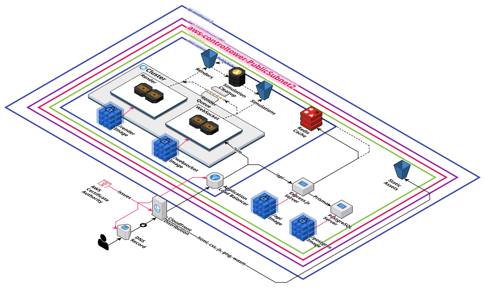

# ThreeJS Particle-Based Fluid Simulation with WebAssembly

By Tarang Janawalkar and Christina Edwards

This project was developed for the unit CAB432 Cloud Computing at the
Queensland University of Technology in Semester 2, 2025.

Grade Achieved: 100%

## Application Architecture

This project implements smoothed particle hydrodynamics through a
real-time particle-based fluid simulator deployed as a distributed
cloud application on AWS. The frontend uses React and Three.js for
interactive 2D visualisation, powered by a high-performance physics
engine written in Rust and compiled to WebAssembly for near-native
browser performance. The Node.js/Express REST API handles
authentication via JWT and Cognito, simulation metadata CRUD, and
session management, which is backed by PostgreSQL for persistent
storage and Redis ElastiCache for caching.

The system features a distributed rendering architecture through a Rust
WebSocket server, where recorded simulations are processed through a
scalable Blender-based pipeline on ECS Fargate, with render jobs
distributed via an SQS queue across multiple workers. An event-driven
Lambda function handles automatic storage cleanup on render completion.
Auto-scaling uses SQS queue depth as a custom CloudWatch metric to
scale render workers based on actual workload demand rather than CPU
utilisation.

The web application uses a microservices architecture with full
infrastructure automation. All service images are containerised with
Docker and stored in ECR. Infrastructure provisioning, deployment, and
cache invalidation are automated through Terraform and Bash, covering
ECS, EC2, S3, CloudFront, Route 53, ALB with path-based routing, SQS,
ECR, Lambda, ElastiCache, Secrets Manager, Parameter Store, and ACM.
All credentials are stored in AWS Secrets Manager and parameters in
Parameter Store. Security follows defence-in-depth practices including
least-privilege IAM roles per service, HTTPS everywhere, network
isolation, pre-signed S3 URLs, and container scanning via ECR.



## References

Particle-Based Fluid Simulation:
- https://cseweb.ucsd.edu/classes/wi20/cse169-a/slides/CSE169_16.pdf

Smoothed Particle Hydrodynamics:
- https://cs418.cs.illinois.edu/website/text/sph.html
- https://personal.ems.psu.edu/~fkd/courses/EGEE520/2017Deliverables/SPH_2017.pdf

## Credits

Hashing implementation:
- https://github.com/SebLague/Fluid-Sim

## Steps to Provision and Deploy the Application

```bash
./provision-infrastructure.sh
./deploy-application.sh
```
